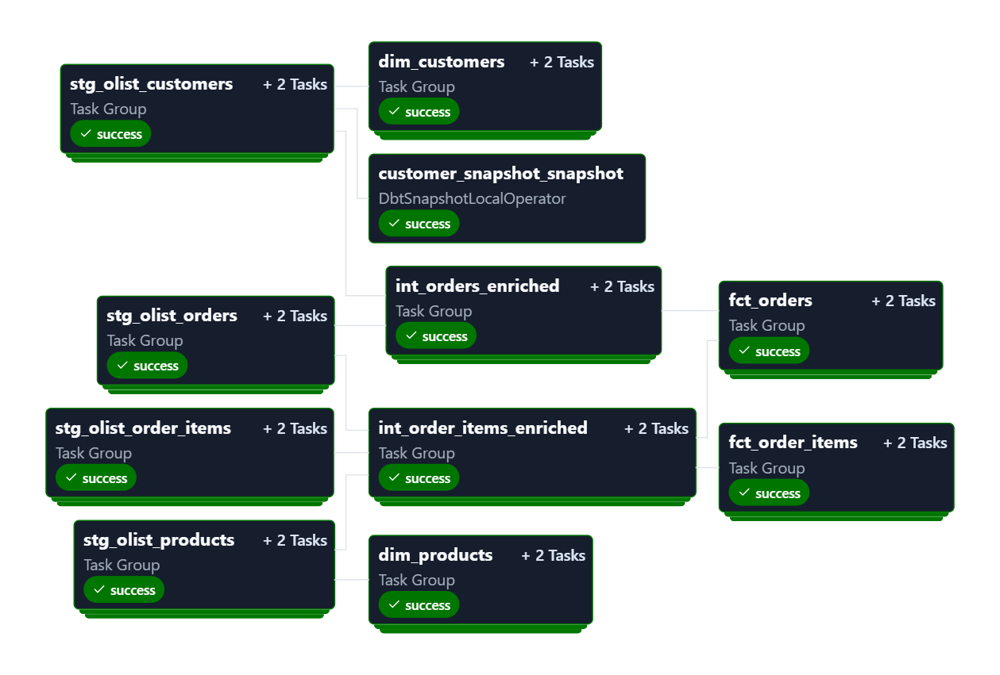

# 🚀 End-to-End ELT Pipeline | Snowflake + dbt + Airflow (Cosmos)

## 📌 Project Overview

This project implements a production-style ELT data pipeline using a modern data stack.

The pipeline processes the **Brazilian E-Commerce Public Dataset (Olist)** and transforms raw data into analytics-ready models using a layered transformation architecture.

Orchestration is handled by Apache Airflow with dynamic DAG generation powered by Cosmos, running via Astro.

---

## 🏗 Architecture Overview

```
Raw CSV Data (Olist - Kaggle)
↓
Snowflake (RAW Layer)
↓
dbt (Staging Layer)
↓
dbt (Intermediate Layer)
↓   
dbt (Marts Layer - Star Schema)
↓
Airflow + Cosmos (Orchestration)
```
---

## 🔹 Tech Stack

- **Snowflake** – Cloud Data Warehouse
- **dbt** – Transformation & Data Modeling
- **Apache Airflow** – Workflow Orchestration
- **Astronomer Cosmos** – Dynamic dbt DAG generation
- **Astro CLI** – Local Airflow runtime environment

---

## 🧱 Data Modeling Strategy

### 1️⃣ RAW Layer (Snowflake)
- Data loaded as-is
- No transformation
- Source of truth

### 2️⃣ Staging Layer (dbt)
- Column renaming (snake_case)
- Type casting (timestamps, numerics)
- Status normalization
- Deduplication
- Data quality tests

### 3️⃣ Intermediate Layer (dbt)
- Business logic transformations
- Revenue calculations
- Table joins
- Grain enforcement

### 4️⃣ Marts Layer (Star Schema)
- `dim_customers`
- `dim_products`
- `fct_orders`
- `fct_order_items`

---

## 🔁 Incremental Models

Fact tables are implemented as incremental models:

- Efficient processing of new data
- Scalable for large datasets

---

## 🕰 Slowly Changing Dimensions (SCD Type 2)

Implemented using dbt snapshots:

- Tracks customer attribute changes
- Maintains historical state
- Enables time-based analysis

---

## 🧪 Data Quality & Testing

Implemented dbt tests:

- `not_null`
- `unique`
- `accepted_values`
- `relationships`
- Composite primary key validation

Ensures:
- Referential integrity
- No duplicate primary keys
- Proper grain enforcement

---

## ⚙ Orchestration with Airflow + Cosmos

Airflow dynamically generates DAGs from the dbt project using Cosmos.

Benefits:

- Each dbt model becomes an Airflow task
- Automatic dependency resolution
- Model-level retry capability
- Clear observability in Airflow UI

Execution Flow:

```
 Staging → Intermediate → Marts → Snapshots → Tests
```


---

## 🚀 How to Run Locally

- **Note** : Make sure you have started the docker engine started before running the code.
    
1. Start Astro:

```bash
astro dev start
 ```
2. Open Airflow UI:
```
http://localhost:8080
```

3. Configure Snowflake connection in Airflow

4. Trigger the dbt_olist_cosmos DAG

Output:


